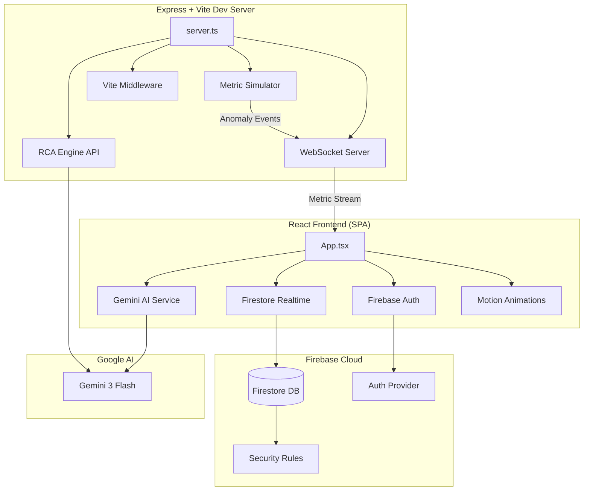

<div align="center">


# Aegis — Incident Intelligence Platform

[](https://www.typescriptlang.org/)
[](https://react.dev/)
[](https://firebase.google.com/)
[](https://ai.google.dev/)
[](https://tailwindcss.com/)
[](LICENSE)

**An AI-powered incident management and intelligence platform for reporting, tracking, and analyzing security & operational incidents with real-time collaboration and LLM-driven analysis.**

[Live Demo](https://ai.studio/apps/b943e8b9-28d9-45a8-aa33-54c1ffda4a6b) • [Architecture](#-architecture) • [Features](#-features) • [Quick Start](#-quick-start) • [Tech Stack](#-tech-stack)

</div>

---

## 🧠 What Is Aegis?

Aegis is a **real-time incident intelligence platform** that combines modern frontend engineering with AI-powered analysis to give teams a comprehensive view of security and operational incidents. Instead of just logging incidents in a spreadsheet, Aegis uses **Google Gemini AI** to automatically generate executive summaries, analyze incident severity, suggest categorizations, and identify trends across your incident landscape.

Built as a Google AI Studio applet, it leverages **Firebase** for real-time data synchronization and **Google Authentication** for secure access — providing an enterprise-grade incident management experience with zero backend infrastructure to manage.

---

## ✨ Features

### Core Incident Management
- **📝 Incident Reporting** — Structured form-based reporting with title, description, severity (Low → Critical), and category tagging
- **📊 Dashboard** — Real-time data grid with filterable incident list, searching, and severity/status filtering
- **🔄 Status Lifecycle** — Full incident workflow: `Open` → `In Progress` → `Resolved` → `Closed`
- **💬 Communication Log** — Threaded comment system on each incident for team collaboration
- **📍 Location Tracking** — Optional GPS/geolocation data capture per incident

### AI-Powered Intelligence
- **🤖 Executive Summary** — One-click Gemini AI analysis of your entire incident landscape with trend identification
- **🔍 Incident Analysis** — AI-driven severity assessment and category suggestion via structured JSON output
- **📈 Trend Detection** — Cross-incident pattern analysis highlighting critical issues and emerging risks

### Security & Access Control
- **🔐 Google OAuth** — Secure authentication via Firebase Auth with Google Sign-In
- **👥 RBAC** — Three-tier role system: `Admin`, `Responder`, `Reporter`
- **🛡️ Firestore Rules** — 136-line server-side security rules with field-level validation, ownership checks, and role-based write access
- **✅ Data Validation** — Strict schema enforcement on all Firestore operations with allowlisted fields

### Real-Time Architecture
- **⚡ WebSocket Metrics** — Built-in metric simulator broadcasting CPU, memory, API latency, and error rate data via WebSocket
- **🔴 Anomaly Injection** — Simulator injects anomalous values (5% probability) to demonstrate incident triggering scenarios
- **🏥 Health Endpoint** — Express server health check at `/api/v1/health`
- **🤖 RCA Engine** — Backend endpoint (`/api/v1/rca`) for LLM-based Root Cause Analysis via Gemini

---

## 🏗️ Architecture



### Data Flow

```
User Action (Report/Update/Comment)
  │
  ▼
React App (validation + optimistic UI)
  │
  ▼
Firebase Firestore (real-time sync)
  │
  ▼
Firestore Security Rules (136 lines of validation)
  │
  ▼
onSnapshot Listeners (all connected clients update)
```

### Backend Data Flow (Simulator)

```
Metric Simulator (2s interval)
  │
  ▼
Generate Synthetic Metrics (3 services × 4 metric types)
  │
  ├── Normal: cpu ~20-60%, memory ~40-70%, latency ~100-300ms, errors ~0-2%
  └── Anomaly (5%): cpu ~90-100%, memory ~95-100%, latency ~2500-3500ms, errors ~15-35%
  │
  ▼
WebSocket Broadcast → All Connected Dashboard Clients
```

---

## 📁 Project Structure

```
aegis-incident-intelligence/
├── src/
│   ├── App.tsx                  # Main SPA component (576 lines)
│   │                             # - Dashboard view with data grid
│   │                             # - Incident report form
│   │                             # - Incident detail + comments
│   ├── firebase.ts              # Firebase init, auth, error handling
│   ├── types.ts                 # TypeScript interfaces (Incident, User, Comment)
│   ├── index.css                # Custom design system (Tailwind v4 + custom classes)
│   ├── main.tsx                 # React 19 entry point
│   └── services/
│       └── geminiService.ts     # Gemini AI integration (analysis + summaries)
│
├── server.ts                    # Express server with:
│                                 # - WebSocket metric streaming
│                                 # - RCA engine endpoint (/api/v1/rca)
│                                 # - Health check (/api/v1/health)
│                                 # - Built-in metric simulator
│
├── design/
│   ├── design.md               # Full system design document (961 lines)
│   ├── requirements.md         # 16 requirement groups with acceptance criteria
│   └── tasks.md                # 25-task implementation plan with traceability
│
├── firestore.rules             # Firebase security rules (136 lines, RBAC)
├── firebase-blueprint.json     # Firestore schema definitions
├── firebase-applet-config.json # Firebase project config
├── metadata.json               # App metadata (name, permissions)
├── vite.config.ts              # Vite + React + Tailwind v4 config
├── tsconfig.json               # TypeScript 5.8 strict config
├── package.json                # Dependencies and scripts
├── .env.example                # Environment variable template
└── index.html                  # SPA entry HTML
```

---

## 🛠️ Tech Stack

| Layer | Technology | Purpose |
|-------|-----------|---------|
| **Frontend** | React 19 + TypeScript 5.8 | UI components, state management |
| **Styling** | Tailwind CSS v4 + Custom Design System | Brutalist/editorial aesthetic with custom data grid |
| **Animations** | Motion (Framer Motion) | Page transitions, mount/unmount animations |
| **Charts** | Recharts | Data visualization (available for metric charts) |
| **Markdown** | react-markdown | Rich text rendering for AI summaries |
| **Icons** | Lucide React | Consistent iconography |
| **Backend** | Express + Vite Dev Server | API endpoints, WebSocket, dev middleware |
| **Database** | Firebase Firestore | Real-time NoSQL database with offline support |
| **Auth** | Firebase Auth (Google OAuth) | Secure authentication |
| **AI** | Google Gemini 3 Flash (Preview) | Incident analysis, executive summaries, RCA |
| **Security** | Firestore Security Rules | Server-side RBAC and field validation |
| **Build** | Vite | Fast HMR, production bundling |

---

## 🚀 Quick Start

### Prerequisites

- **Node.js** (v18+)  
- **Gemini API Key** — Get one from [Google AI Studio](https://ai.google.dev/)

### Installation

```bash
# Clone the repository
git clone https://github.com/yourusername/Aegis---Incident-Intelligence.git
cd Aegis---Incident-Intelligence

# Install dependencies
npm install

# Set up environment variables
cp .env.example .env.local
# Edit .env.local and add your GEMINI_API_KEY

# Start development server
npm run dev
```

The app will be available at `http://localhost:3000`.

### Environment Variables

| Variable | Required | Description |
|----------|----------|-------------|
| `GEMINI_API_KEY` | ✅ | Google Gemini API key for AI features |
| `APP_URL` | ❌ | Hosting URL (auto-injected in AI Studio) |

### Available Scripts

| Script | Command | Description |
|--------|---------|-------------|
| `dev` | `tsx server.ts` | Start Express + Vite dev server |
| `build` | `vite build` | Production build |
| `preview` | `vite preview` | Preview production build |
| `lint` | `tsc --noEmit` | TypeScript type checking |
| `clean` | `rm -rf dist` | Clean build artifacts |

---

## 🔒 Security Model

### Firestore Rules (RBAC)

The platform implements a comprehensive 136-line Firestore Security Rules configuration:

| Role | Incidents | Comments | Users |
|------|-----------|----------|-------|
| **Admin** | Full CRUD + Delete | Full CRUD + Delete | Read all, manage roles |
| **Responder** | Read + Update status | Read + Create | Read all |
| **Reporter** | Read + Create own | Read + Create | Read all, update own |

### Key Security Features

- ✅ **Field allowlisting** — Only defined fields accepted (`hasOnlyAllowedFields`)
- ✅ **Ownership enforcement** — Users can only modify their own profiles and incidents
- ✅ **Type validation** — String lengths (title ≤ 100, description ≤ 2000), enum values, email format
- ✅ **Immutability** — `createdAt`, `reporterUid`, and `uid` cannot be modified after creation
- ✅ **Admin bypass** — Verified admin email with hardcoded fallback

---

## 🎨 Design Philosophy

Aegis uses a **brutalist/editorial** design language:

- **Typography**: Inter (sans) + JetBrains Mono (mono) + Georgia (serif headers)
- **Color**: Muted parchment background (`#E4E3E0`) with pure black ink (`#141414`)
- **Grid**: Visible 5-column data grid with hover-invert effect
- **Badges**: Monospace severity/status badges with color-coded borders
- **Interaction**: Black-to-transparent button transitions, 2px focus borders
- **Animation**: Framer Motion page transitions with fade and slide effects

---

## 📐 Design Documentation

This project includes extensive formal design documentation in the `design/` directory:

| Document | Lines | Purpose |
|----------|-------|---------|
| [design.md](design/design.md) | 961 | Full system architecture, data models, correctness properties (P1-P30), error handling, testing strategy |
| [requirements.md](design/requirements.md) | 290 | 16 requirement groups with user stories and acceptance criteria |
| [tasks.md](design/tasks.md) | 345 | 25-task implementation plan with requirement traceability |

> **Note:** The design documents describe the **full-scale backend architecture** (FastAPI, Celery, PostgreSQL, Redis) as the target state. The current implementation is a Firebase-based frontend-first approach. See [CROSS_VERIFICATION.md](CROSS_VERIFICATION.md) for a detailed gap analysis.

---

## 🤝 Contributing

1. Fork the repository
2. Create a feature branch (`git checkout -b feature/your-feature`)
3. Commit your changes (`git commit -m 'Add your feature'`)
4. Push to the branch (`git push origin feature/your-feature`)
5. Open a Pull Request

---

## 📄 License

This project is licensed under the MIT License.

---

<div align="center">

**Built with ❤️ using React, Firebase, and Google Gemini AI**

*Aegis Incident Intelligence // v1.0.4 © Sentinel Systems*

</div>
