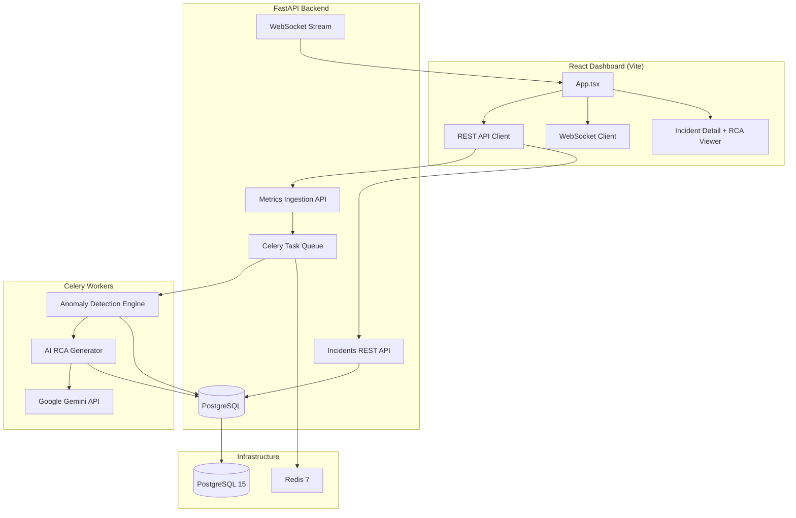

<div align="center">

# Vigilinex — Incident Intelligence Platform

[](https://python.org/)
[](https://fastapi.tiangolo.com/)
[](https://react.dev/)
[](https://ai.google.dev/)
[](https://www.postgresql.org/)
[](https://docs.docker.com/compose/)
[](LICENSE)

**An AI-powered, real-time incident intelligence platform with automated anomaly detection, LLM-driven root cause analysis, and live telemetry streaming — fully containerized with Docker.**

[Architecture](#-architecture) • [Features](#-features) • [Quick Start](#-quick-start) • [Tech Stack](#-tech-stack)

</div>

---

## 🧠 What Is Vigilinex?

Vigilinex is a **real-time incident intelligence engine** that autonomously detects infrastructure anomalies, generates AI-driven Root Cause Analysis (RCA) using Google Gemini, and pushes live incidents to a reactive dashboard — all without human intervention.

Instead of waiting for alerts and manually diagnosing failures, Vigilinex:
- **Ingests continuous telemetry** from microservices (CPU, memory, latency, error rates)
- **Detects anomalies** using a rolling 2-sigma statistical threshold engine
- **Triggers automated RCA** via Google Gemini, producing natural language root cause analysis
- **Pushes incidents in real-time** via WebSocket to a sleek React dashboard

The entire stack runs locally via `docker-compose` with zero cloud dependencies.

---

## ✨ Features

### Autonomous Anomaly Detection
- **📊 Statistical Engine** — Rolling 2-sigma threshold detection across 50-metric sliding windows
- **🎯 Multi-Service Monitoring** — Tracks CPU, memory, response time, and error rates across multiple services
- **⚡ Background Processing** — Celery workers with Redis message broker for async anomaly processing

### AI-Powered Intelligence
- **🤖 Automated RCA** — Google Gemini generates structured root cause analysis for every detected anomaly
- **🔍 Probable Cause Detection** — AI extracts the most likely failure scenario from metric context
- **📝 Markdown Reports** — Rich, formatted analysis rendered directly in the dashboard

### Real-Time Architecture
- **🔴 WebSocket Streaming** — Live metric and incident push to all connected dashboard clients
- **🗄️ PostgreSQL Persistence** — Full relational data model with async SQLAlchemy and asyncpg
- **🐳 Containerized Stack** — One-command deployment via `docker-compose`

### Dashboard & UI
- **🦅 Custom Branding** — Professional eagle-shield logo with brutalist/editorial design language
- **🔎 Incident Management** — Search, filter by severity/status, view detailed RCA reports
- **💬 Communication Log** — Threaded comment system for team collaboration on incidents
- **📱 Session Persistence** — localStorage-backed sessions survive browser refreshes

---

## 🏗️ Architecture



### Data Flow

```
Metric Ingestion (POST /api/v1/metrics)
  │
  ▼
FastAPI validates + persists to PostgreSQL
  │
  ▼
Celery task queued via Redis
  │
  ▼
Anomaly Engine (2-sigma rolling threshold)
  │
  ├── Normal: metric archived
  └── Anomaly detected:
       │
       ├── Incident created in PostgreSQL
       ├── Google Gemini queried for RCA
       ├── RCA summary written to incident
       └── WebSocket broadcast to dashboard
```

---

## 📁 Project Structure

```
vigilinex/
├── backend/
│   ├── app/
│   │   ├── main.py              # FastAPI application factory + CORS + WebSocket
│   │   ├── config.py            # Pydantic settings (env vars)
│   │   ├── database.py          # Async SQLAlchemy engine + session
│   │   ├── models.py            # SQLAlchemy ORM models (Incident, Metric, Comment)
│   │   ├── schemas.py           # Pydantic request/response schemas
│   │   ├── repository.py        # Data access layer
│   │   ├── worker.py            # Celery app initialization
│   │   ├── tasks.py             # Anomaly engine + RCA orchestration
│   │   ├── llm.py               # Gemini/OpenAI LLM abstraction
│   │   └── api/v1/
│   │       ├── metrics.py       # POST /api/v1/metrics (telemetry ingestion)
│   │       ├── incidents.py     # GET/POST incidents + comments
│   │       └── health.py        # GET /api/v1/health
│   ├── requirements.txt
│   ├── Dockerfile
│   └── .env                     # API keys (gitignored)
│
├── src/
│   ├── App.tsx                  # React dashboard (470+ lines)
│   ├── api.ts                   # REST + WebSocket client
│   ├── types.ts                 # TypeScript interfaces
│   └── index.css                # Custom design system
│
├── public/
│   └── favicon.png              # Vigilinex eagle-shield logo
│
├── docker-compose.yml           # Full stack orchestration
├── live_stream.py               # Continuous telemetry simulator
├── simulate_anomaly.py          # Single anomaly trigger script
└── index.html                   # Vite SPA entry
```

---

## 🛠️ Tech Stack

| Layer | Technology | Purpose |
|-------|-----------|---------|
| **Frontend** | React 19 + TypeScript 5.8 | Dashboard UI, incident management |
| **Styling** | Tailwind CSS v4 + Custom Design System | Brutalist/editorial aesthetic |
| **Animations** | Motion (Framer Motion) | Page transitions, micro-interactions |
| **Backend** | FastAPI + Uvicorn | REST API, WebSocket streaming |
| **Task Queue** | Celery + Redis 7 | Async anomaly detection & RCA |
| **Database** | PostgreSQL 15 + SQLAlchemy 2.0 (Async) | Relational data persistence |
| **AI Engine** | Google Gemini (google-genai) | Automated root cause analysis |
| **Driver** | asyncpg | High-performance async PostgreSQL |
| **Containerization** | Docker Compose | One-command deployment |
| **Serialization** | Pydantic v2 | Request/response validation |

---

## 🚀 Quick Start

### Prerequisites

- **Docker** & **Docker Compose** installed
- **Gemini API Key** — Get one from [Google AI Studio](https://ai.google.dev/)

### Installation

```bash
# Clone the repository
git clone https://github.com/Satya136-dvsn/Aegis---Incident-Intelligence.git
cd Aegis---Incident-Intelligence

# Configure your API key
cp backend/.env.example backend/.env
# Edit backend/.env and set your GEMINI_API_KEY

# Launch the entire stack
docker-compose up --build
```

The dashboard will be available at `http://localhost:5173`.

### Generate Live Traffic

```bash
# Start continuous telemetry streaming (run in a separate terminal)
python live_stream.py

# Or trigger a single anomaly spike
python simulate_anomaly.py
```

### Environment Variables

| Variable | Required | Description |
|----------|----------|-------------|
| `GEMINI_API_KEY` | ✅ | Google Gemini API key for AI-powered RCA |
| `DATABASE_URL` | Auto | PostgreSQL connection (set by Docker) |
| `REDIS_URL` | Auto | Redis connection (set by Docker) |

> ⚠️ **Security Note:** The `.env` file is gitignored. Never commit API keys to version control.

---

## 🔒 Security

- **API Key Protection** — `.env` files are excluded from Git via `.gitignore`
- **CORS Middleware** — Properly configured FastAPI CORS for frontend origin
- **Input Validation** — Pydantic schema enforcement on all API endpoints
- **Async Database** — Connection pooling via asyncpg for thread-safe operations

---

## 🎨 Design Philosophy

Vigilinex uses a **brutalist/editorial** design language:

- **Typography**: Inter (sans) + JetBrains Mono (mono) + Georgia (serif headers)
- **Color**: Muted parchment background (`#E4E3E0`) with pure black ink (`#141414`)
- **Grid**: Visible 5-column data grid with hover-invert effect
- **Badges**: Monospace severity/status badges with color-coded borders
- **Animation**: Framer Motion page transitions with fade and slide effects

---

## 🤝 Contributing

1. Fork the repository
2. Create a feature branch (`git checkout -b feature/your-feature`)
3. Commit your changes (`git commit -m 'Add your feature'`)
4. Push to the branch (`git push origin feature/your-feature`)
5. Open a Pull Request

---

## 📄 License

This project is licensed under the MIT License — see [LICENSE](LICENSE) for details.

---

<div align="center">

**Built with ❤️ using FastAPI, React, Celery, PostgreSQL, and Google Gemini AI**

*Vigilinex — Incident Intelligence // © 2026*

</div>
