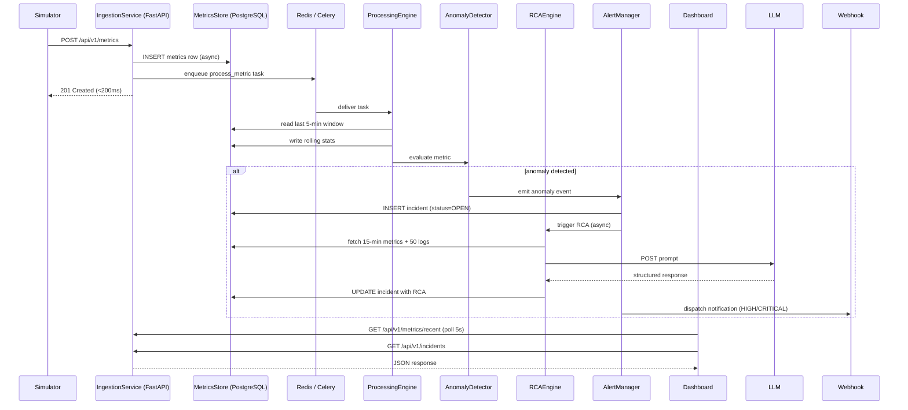

# Design Document: Real-Time Incident Intelligence Platform

## Overview

The Real-Time Incident Intelligence Platform is an AI-powered observability system that ingests synthetic system metrics and logs, detects anomalies using threshold and statistical methods, and uses an LLM to automatically generate root cause analysis (RCA) reports with remediation suggestions. It is designed as a portfolio/demonstration project showcasing SRE and backend engineering skills.

The platform is fully self-contained: a built-in Simulator generates synthetic data, all components run in Docker containers, and the React dashboard provides a live view of system health and incidents.

### Key Design Goals

- Sub-200ms p95 ingestion latency with 10,000+ events/minute throughput
- Fully async processing pipeline decoupled from HTTP ingestion
- Graceful degradation when DB, Redis, or LLM are unavailable
- Runtime-selectable LLM provider (OpenAI GPT-4o or Google Gemini)
- Secret sanitization before any data reaches the LLM
- Horizontal worker scaling via a single environment variable

---

## Architecture

### High-Level Architecture

```
┌─────────────────────────────────────────────────────────────────────┐
│                        Docker Compose Network                        │
│                                                                      │
│  ┌──────────────┐    POST /api/v1/metrics    ┌──────────────────┐   │
│  │  Simulator   │ ─────────────────────────► │  IngestionService│   │
│  │  (Python bg) │    POST /api/v1/logs        │  (FastAPI)       │   │
│  └──────────────┘                            └────────┬─────────┘   │
│                                                       │ async write  │
│                                              ┌────────▼─────────┐   │
│                                              │  MetricsStore    │   │
│                                              │  (PostgreSQL)    │   │
│                                              └────────┬─────────┘   │
│                                                       │ enqueue      │
│                                              ┌────────▼─────────┐   │
│                                              │  Redis Broker    │   │
│                                              └────────┬─────────┘   │
│                                                       │ consume      │
│                                         ┌─────────────▼──────────┐  │
│                                         │   ProcessingEngine     │  │
│                                         │   (Celery Workers)     │  │
│                                         └─────────────┬──────────┘  │
│                                                       │              │
│                                         ┌─────────────▼──────────┐  │
│                                         │   AnomalyDetector      │  │
│                                         │   (threshold + 2σ)     │  │
│                                         └─────────────┬──────────┘  │
│                                                       │ anomaly event│
│                                    ┌──────────────────┼──────────┐  │
│                                    │                  │          │  │
│                          ┌─────────▼──────┐  ┌───────▼───────┐  │  │
│                          │   RCAEngine    │  │ AlertManager  │  │  │
│                          │ (LLM: GPT-4o/ │  │ (Incidents +  │  │  │
│                          │  Gemini)       │  │  Webhooks)    │  │  │
│                          └─────────┬──────┘  └───────┬───────┘  │  │
│                                    └──────────────────┘          │  │
│                                              │ persist RCA        │  │
│                                    ┌─────────▼──────────────┐    │  │
│                                    │     MetricsStore       │    │  │
│                                    │  (incidents table)     │    │  │
│                                    └─────────┬──────────────┘    │  │
│                                              │ poll / WebSocket   │  │
│                                    ┌─────────▼──────────────┐    │  │
│                                    │   Dashboard (React)    │    │  │
│                                    │   GET /api/v1/*        │    │  │
│                                    └────────────────────────┘    │  │
└─────────────────────────────────────────────────────────────────────┘
```

### Component Interaction — Data Flow



---

## Components and Interfaces

### 1. IngestionService

FastAPI application serving as the entry point for all incoming data.

**Responsibilities:**
- Validate incoming metric and log payloads via Pydantic models
- Persist validated records to PostgreSQL asynchronously (SQLAlchemy async session)
- Enqueue a Celery task for each persisted metric
- Enforce rate limiting (slowapi / Redis-backed token bucket)
- Return consistent JSON envelope responses

**Key design decisions:**
- Uses `asyncpg` driver with SQLAlchemy async for non-blocking DB writes, keeping p95 latency under 200ms
- Pydantic v2 validators enforce field-level range checks (e.g., cpu_usage ∈ [0, 100])
- Rate limiter uses Redis; falls back to in-memory limiter if Redis is unavailable
- Strict mode Pydantic models reject extra fields (satisfies Req 16.1)

**Endpoints:**

| Method | Path | Description |
|--------|------|-------------|
| POST | `/api/v1/metrics` | Ingest a metric event |
| POST | `/api/v1/logs` | Ingest a log event |
| GET | `/api/v1/health` | DB + queue health check |
| GET | `/api/v1/metrics/recent` | Recent metrics for dashboard |
| GET | `/api/v1/incidents` | Paginated incident list |
| GET | `/api/v1/incidents/{id}` | Single incident with RCA |
| PATCH | `/api/v1/incidents/{id}` | Update incident status |
| GET | `/api/v1/ws/metrics` | WebSocket live metric stream |

### 2. MetricsStore

PostgreSQL database accessed via SQLAlchemy ORM with Alembic migrations.

**Responsibilities:**
- Persist raw metrics, log events, incidents, rolling stats, and dead-letter records
- Provide efficient time-range queries via composite indexes
- Enforce data retention via a scheduled cleanup task

### 3. ProcessingEngine

Celery worker pool consuming from a Redis-backed task queue.

**Responsibilities:**
- Compute rolling 5-minute mean and standard deviation per `(service_name, metric_type)`
- Cap `api_response_time_ms` at configurable max (default 60,000ms)
- Flag statistical outliers (>3σ from rolling mean) as anomaly candidates
- Retry failed tasks up to 3 times; move to dead-letter store on exhaustion
- Fall back to synchronous in-process execution if Redis is unavailable (Req 15.2)

**Key design decisions:**
- Uses Pandas `rolling()` on a DataFrame built from the last 5-minute window fetched from DB
- Dead-letter store is a `dead_letter_tasks` table in PostgreSQL (not a separate queue) for simplicity
- `WORKER_CONCURRENCY` env var maps directly to Celery's `--concurrency` flag

### 4. AnomalyDetector

Pure Python module called synchronously within the ProcessingEngine Celery task.

**Responsibilities:**
- Evaluate metrics against static thresholds
- Evaluate metrics against 2σ statistical baseline
- Assign severity (LOW / MEDIUM / HIGH / CRITICAL)
- Deduplicate anomaly events within a 2-minute window (checked against `incidents` table)

**Severity classification logic:**

```
breach_ratio = (value - threshold) / threshold

LOW      → 2σ deviation only, no threshold breach
MEDIUM   → breach_ratio < 0.20
HIGH     → 0.20 ≤ breach_ratio < 0.50
CRITICAL → breach_ratio ≥ 0.50
```

**Static thresholds:**

| Metric Type | Threshold |
|-------------|-----------|
| cpu_usage | ≥ 85% |
| memory_usage | ≥ 90% |
| api_response_time_ms | ≥ 2000ms |
| error_rate_percent | ≥ 5% |

### 5. RCAEngine

Async service that constructs LLM prompts and parses structured responses.

**Responsibilities:**
- Retrieve last 15 minutes of metrics + last 50 log events for the affected service
- Redact secrets from log content before prompt construction
- Submit prompt to configured LLM provider (OpenAI or Gemini)
- Parse response into `probable_cause`, `contributing_factors`, `suggested_fixes`
- Retry once after 60s on failure; store placeholder on repeated failure
- Support runtime provider selection via `RCA_PROVIDER` env var

**Secret redaction patterns (regex):**
```python
SECRET_PATTERNS = [
    r'(?i)(api[_-]?key|apikey)\s*[:=]\s*\S+',
    r'(?i)(password|passwd|pwd)\s*[:=]\s*\S+',
    r'(?i)(token|secret|credential)\s*[:=]\s*\S+',
    r'Bearer\s+[A-Za-z0-9\-._~+/]+=*',
    r'[A-Za-z0-9]{32,}',  # generic long tokens
]
```

**LLM prompt structure:**
```
System: You are an SRE assistant. Analyze the following anomaly and return JSON only.
User:
  Anomaly: {service_name} {metric_type}={value} (severity={severity})
  Metric history (last 15 min): [...]
  Recent logs (last 50): [...]
  
  Return JSON: {"probable_cause": "...", "contributing_factors": [...], "suggested_fixes": [...]}
```

**Provider abstraction:**
```python
class LLMProvider(Protocol):
    async def complete(self, prompt: str) -> str: ...

class OpenAIProvider:
    async def complete(self, prompt: str) -> str: ...

class GeminiProvider:
    async def complete(self, prompt: str) -> str: ...
```

### 6. AlertManager

Module called within the anomaly detection flow.

**Responsibilities:**
- Create `Incident` records in PostgreSQL
- Dispatch webhook/email notifications for HIGH and CRITICAL incidents within 10s
- Expose REST endpoints for incident CRUD
- Log WARNING if no notification channel is configured

**Notification dispatch:**
- Webhook: HTTP POST with incident JSON payload, 5s timeout, fire-and-forget (non-blocking)
- Email: SMTP via `smtplib` or SendGrid API (optional, configured via env vars)
- Dispatched as a Celery task to avoid blocking the anomaly detection flow

### 7. Dashboard

React single-page application served as static files by the FastAPI backend (or a separate Nginx container).

**Responsibilities:**
- Display real-time line charts per metric type (recharts library)
- Show incident list with severity badges and RCA links
- Display per-service health summary (HEALTHY / DEGRADED / CRITICAL)
- Use WebSocket when available, fall back to 5-second polling

**Key design decisions:**
- WebSocket endpoint `/api/v1/ws/metrics` pushes metric updates from the backend
- Health status derived from most recent anomaly state per service (no threshold re-evaluation on frontend)
- Incident status updates reflected within 10s via polling or WebSocket push

### 8. Simulator

Background Python process (runs as a separate Docker service).

**Responsibilities:**
- Generate synthetic metrics for 2+ named services at configurable interval (default 10s)
- Inject anomalous values at configurable probability (default 5%)
- POST to IngestionService endpoints
- Start automatically when platform starts in simulation mode

---

## Data Models

### PostgreSQL Schema

#### `metrics` table

```sql
CREATE TABLE metrics (
    id              UUID PRIMARY KEY DEFAULT gen_random_uuid(),
    service_name    VARCHAR(100) NOT NULL,
    metric_type     VARCHAR(50)  NOT NULL,  -- cpu_usage, memory_usage, api_response_time_ms, error_rate_percent
    value           FLOAT        NOT NULL,
    timestamp       TIMESTAMPTZ  NOT NULL,
    is_anomaly      BOOLEAN      NOT NULL DEFAULT FALSE,
    created_at      TIMESTAMPTZ  NOT NULL DEFAULT NOW()
);

CREATE INDEX idx_metrics_service_type_ts
    ON metrics (service_name, metric_type, timestamp DESC);

CREATE INDEX idx_metrics_timestamp
    ON metrics (timestamp DESC);
```

#### `log_events` table

```sql
CREATE TABLE log_events (
    id              UUID PRIMARY KEY DEFAULT gen_random_uuid(),
    service_name    VARCHAR(100) NOT NULL,
    level           VARCHAR(20)  NOT NULL,  -- DEBUG, INFO, WARNING, ERROR, CRITICAL
    message         TEXT         NOT NULL,
    timestamp       TIMESTAMPTZ  NOT NULL,
    created_at      TIMESTAMPTZ  NOT NULL DEFAULT NOW()
);

CREATE INDEX idx_log_events_service_ts
    ON log_events (service_name, timestamp DESC);
```

#### `incidents` table

```sql
CREATE TABLE incidents (
    id                      UUID PRIMARY KEY DEFAULT gen_random_uuid(),
    service_name            VARCHAR(100) NOT NULL,
    metric_type             VARCHAR(50)  NOT NULL,
    severity                VARCHAR(20)  NOT NULL,  -- LOW, MEDIUM, HIGH, CRITICAL
    detected_at             TIMESTAMPTZ  NOT NULL,
    status                  VARCHAR(20)  NOT NULL DEFAULT 'OPEN',  -- OPEN, ACKNOWLEDGED, RESOLVED
    rca_probable_cause      TEXT,
    rca_contributing_factors JSONB,
    rca_suggested_fixes     JSONB,
    created_at              TIMESTAMPTZ  NOT NULL DEFAULT NOW(),
    updated_at              TIMESTAMPTZ  NOT NULL DEFAULT NOW()
);

CREATE INDEX idx_incidents_status     ON incidents (status);
CREATE INDEX idx_incidents_severity   ON incidents (severity);
CREATE INDEX idx_incidents_service_ts ON incidents (service_name, detected_at DESC);
```

#### `rolling_stats` table

```sql
CREATE TABLE rolling_stats (
    id              UUID PRIMARY KEY DEFAULT gen_random_uuid(),
    service_name    VARCHAR(100) NOT NULL,
    metric_type     VARCHAR(50)  NOT NULL,
    window_end      TIMESTAMPTZ  NOT NULL,
    mean            FLOAT        NOT NULL,
    stddev          FLOAT        NOT NULL,
    sample_count    INTEGER      NOT NULL,
    created_at      TIMESTAMPTZ  NOT NULL DEFAULT NOW(),
    UNIQUE (service_name, metric_type, window_end)
);

CREATE INDEX idx_rolling_stats_lookup
    ON rolling_stats (service_name, metric_type, window_end DESC);
```

#### `dead_letter_tasks` table

```sql
CREATE TABLE dead_letter_tasks (
    id              UUID PRIMARY KEY DEFAULT gen_random_uuid(),
    task_name       VARCHAR(200) NOT NULL,
    payload         JSONB        NOT NULL,
    error_message   TEXT,
    retry_count     INTEGER      NOT NULL DEFAULT 0,
    created_at      TIMESTAMPTZ  NOT NULL DEFAULT NOW()
);
```

### Pydantic Request/Response Models

```python
# Ingestion
class MetricPayload(BaseModel):
    model_config = ConfigDict(extra='forbid')
    service_name: str
    metric_type: Literal['cpu_usage', 'memory_usage', 'api_response_time_ms', 'error_rate_percent']
    value: float
    timestamp: datetime

    @field_validator('value')
    def validate_range(cls, v, info):
        ranges = {
            'cpu_usage': (0, 100),
            'memory_usage': (0, 100),
            'api_response_time_ms': (0, 600_000),
            'error_rate_percent': (0, 100),
        }
        ...

class LogPayload(BaseModel):
    model_config = ConfigDict(extra='forbid')
    service_name: str
    level: Literal['DEBUG', 'INFO', 'WARNING', 'ERROR', 'CRITICAL']
    message: str
    timestamp: datetime

# Response envelope
class APIResponse(BaseModel, Generic[T]):
    data: T | None
    error: str | None
    meta: dict

# Incident
class IncidentResponse(BaseModel):
    id: UUID
    service_name: str
    metric_type: str
    severity: str
    detected_at: datetime
    status: str
    rca_probable_cause: str | None
    rca_contributing_factors: list[str] | None
    rca_suggested_fixes: list[str] | None
    created_at: datetime
    updated_at: datetime
```

### Environment Variables

| Variable | Required | Default | Description |
|----------|----------|---------|-------------|
| `DATABASE_URL` | Yes | — | PostgreSQL connection string |
| `REDIS_URL` | No | `redis://redis:6379/0` | Redis broker URL |
| `RCA_PROVIDER` | Yes | — | `openai` or `gemini` |
| `OPENAI_API_KEY` | Conditional | — | Required if `RCA_PROVIDER=openai` |
| `GEMINI_API_KEY` | Conditional | — | Required if `RCA_PROVIDER=gemini` |
| `WORKER_CONCURRENCY` | No | `2` | Celery worker concurrency |
| `WEBHOOK_URL` | No | — | Notification webhook endpoint |
| `SMTP_HOST` | No | — | Email notification SMTP host |
| `METRIC_RETENTION_DAYS` | No | `30` | Raw metric retention period |
| `API_RESPONSE_TIME_CAP_MS` | No | `60000` | Cap for api_response_time_ms normalization |
| `SIMULATOR_INTERVAL_SECONDS` | No | `10` | Simulator generation interval |
| `ANOMALY_INJECT_PROBABILITY` | No | `0.05` | Simulator anomaly injection probability |
| `RATE_LIMIT_PER_MINUTE` | No | `1000` | Rate limit per IP on ingestion endpoints |

### Project Directory Structure

```
realtime-incident-intelligence-platform/
├── backend/
│   ├── app/
│   │   ├── main.py                  # FastAPI app factory, lifespan
│   │   ├── config.py                # Settings via pydantic-settings
│   │   ├── database.py              # SQLAlchemy async engine + session
│   │   ├── models/
│   │   │   ├── metric.py            # SQLAlchemy ORM models
│   │   │   ├── log_event.py
│   │   │   ├── incident.py
│   │   │   └── rolling_stats.py
│   │   ├── schemas/
│   │   │   ├── metric.py            # Pydantic request/response schemas
│   │   │   ├── log_event.py
│   │   │   └── incident.py
│   │   ├── routers/
│   │   │   ├── ingestion.py         # POST /metrics, POST /logs
│   │   │   ├── incidents.py         # GET/PATCH /incidents
│   │   │   ├── health.py            # GET /health
│   │   │   └── websocket.py         # WS /ws/metrics
│   │   ├── services/
│   │   │   ├── processing_engine.py # Rolling stats, normalization
│   │   │   ├── anomaly_detector.py  # Threshold + statistical detection
│   │   │   ├── rca_engine.py        # LLM prompt + response parsing
│   │   │   ├── alert_manager.py     # Incident creation + notifications
│   │   │   └── llm/
│   │   │       ├── base.py          # LLMProvider Protocol
│   │   │       ├── openai_provider.py
│   │   │       └── gemini_provider.py
│   │   ├── workers/
│   │   │   ├── celery_app.py        # Celery app configuration
│   │   │   └── tasks.py             # Celery task definitions
│   │   └── middleware/
│   │       ├── rate_limiter.py      # slowapi integration
│   │       └── error_handler.py     # Global exception handlers
│   ├── alembic/
│   │   ├── env.py
│   │   └── versions/
│   │       └── 0001_initial_schema.py
│   ├── tests/
│   │   ├── unit/
│   │   ├── integration/
│   │   └── property/                # Property-based tests (Hypothesis)
│   ├── Dockerfile
│   └── requirements.txt
├── simulator/
│   ├── simulator.py
│   └── Dockerfile
├── frontend/
│   ├── src/
│   │   ├── App.tsx
│   │   ├── components/
│   │   │   ├── MetricChart.tsx
│   │   │   ├── IncidentList.tsx
│   │   │   └── HealthSummary.tsx
│   │   └── hooks/
│   │       └── useMetrics.ts
│   ├── package.json
│   └── Dockerfile
├── docker-compose.yml
├── render.yaml
└── .env.example
```

---


## Correctness Properties

*A property is a characteristic or behavior that should hold true across all valid executions of a system — essentially, a formal statement about what the system should do. Properties serve as the bridge between human-readable specifications and machine-verifiable correctness guarantees.*

### Property 1: Metric ingestion round-trip

*For any* valid metric payload (service_name, metric_type, value, timestamp), posting it to `/api/v1/metrics` and then querying the MetricsStore should return a record with matching field values.

**Validates: Requirements 1.2**

---

### Property 2: Log ingestion round-trip

*For any* valid log payload (service_name, level, message, timestamp), posting it to `/api/v1/logs` and then querying the MetricsStore should return a record with matching field values.

**Validates: Requirements 2.2**

---

### Property 3: Payload validation rejects invalid inputs

*For any* metric or log payload that is missing a required field, contains an unexpected extra field, has an invalid data type, or has a metric value outside the valid range for its metric_type, the IngestionService should return HTTP 422.

**Validates: Requirements 1.3, 1.4, 2.3, 16.1**

---

### Property 4: Rolling statistics correctness

*For any* non-empty set of metric values within a 5-minute window for a given (service_name, metric_type) pair, the ProcessingEngine's computed mean and standard deviation should equal the mathematically correct values for that sample set.

**Validates: Requirements 4.2**

---

### Property 5: Outlier flagging

*For any* metric value that is more than 3 standard deviations above the rolling mean for its (service_name, metric_type) pair, the ProcessingEngine should set `is_anomaly = true` on that record.

**Validates: Requirements 4.3**

---

### Property 6: Response time normalization cap

*For any* `api_response_time_ms` metric value that exceeds the configured cap (default 60,000ms), the value stored in the MetricsStore should equal the cap value, not the original value.

**Validates: Requirements 4.4**

---

### Property 7: Dead-letter on exhausted retries

*For any* metric record whose processing fails on every attempt, after exactly 3 retry attempts the record should appear in the dead-letter store and should not be silently dropped.

**Validates: Requirements 4.5**

---

### Property 8: Threshold-based anomaly detection

*For any* processed metric whose value meets or exceeds the static threshold for its metric_type (cpu_usage ≥ 85%, memory_usage ≥ 90%, api_response_time_ms ≥ 2000ms, error_rate_percent ≥ 5%), the AnomalyDetector should flag it as anomalous.

**Validates: Requirements 5.1**

---

### Property 9: Statistical anomaly detection

*For any* processed metric whose value is more than 2 standard deviations above the rolling mean for its (service_name, metric_type) pair, the AnomalyDetector should flag it as anomalous regardless of whether it breaches a static threshold.

**Validates: Requirements 5.2**

---

### Property 10: Severity classification correctness

*For any* anomalous metric value and its corresponding threshold, the assigned severity should match the breach_ratio formula: LOW if statistical-only, MEDIUM if breach_ratio < 0.20, HIGH if 0.20 ≤ breach_ratio < 0.50, CRITICAL if breach_ratio ≥ 0.50.

**Validates: Requirements 5.3**

---

### Property 11: Anomaly event completeness

*For any* detected anomaly, the emitted anomaly event should contain all required fields: service_name, metric_type, value, severity, detected_at, rolling mean, and rolling standard deviation.

**Validates: Requirements 5.4**

---

### Property 12: Anomaly deduplication within 2-minute window

*For any* two anomaly events for the same (service_name, metric_type) pair where the second event occurs within 2 minutes of the first, only the first event should be emitted; the second should be suppressed.

**Validates: Requirements 5.5**

---

### Property 13: RCA context retrieval bounds

*For any* anomaly event, the context retrieved by the RCAEngine should contain only metric records from the last 15 minutes and at most 50 log events, all scoped to the affected service.

**Validates: Requirements 6.1**

---

### Property 14: RCA prompt contains required context

*For any* anomaly event and its retrieved context, the constructed LLM prompt should contain the anomaly details (service_name, metric_type, value, severity), the metric history, and the log events.

**Validates: Requirements 6.2**

---

### Property 15: RCA response parsing

*For any* valid LLM JSON response string, parsing it should produce a structured object with non-null `probable_cause` (string), `contributing_factors` (list of strings), and `suggested_fixes` (list of strings).

**Validates: Requirements 6.3**

---

### Property 16: Secret redaction from LLM prompts

*For any* log event message containing patterns matching secrets (API keys, passwords, tokens, Bearer tokens, or long alphanumeric strings), the constructed LLM prompt should not contain those original secret values — they should be replaced with a redaction placeholder.

**Validates: Requirements 6.7, 16.2**

---

### Property 17: Incident creation completeness

*For any* anomaly event, the Incident record created by the AlertManager should contain all required fields: id, service_name, metric_type, severity, detected_at, status (defaulting to OPEN), and should be retrievable via GET /api/v1/incidents/{id} including any associated RCA result.

**Validates: Requirements 7.1, 7.6**

---

### Property 18: Incident list filtering

*For any* combination of status and severity filter values, all incidents returned by GET /api/v1/incidents should match the specified filter criteria — no incident outside the filter should appear in the results.

**Validates: Requirements 7.2**

---

### Property 19: Incident status update round-trip

*For any* existing incident, patching its status to ACKNOWLEDGED or RESOLVED via PATCH /api/v1/incidents/{id} and then fetching it via GET /api/v1/incidents/{id} should return the updated status value.

**Validates: Requirements 7.3**

---

### Property 20: HIGH/CRITICAL notification dispatch

*For any* incident created with severity HIGH or CRITICAL, when a notification channel is configured, a notification should be dispatched to that channel.

**Validates: Requirements 7.4**

---

### Property 21: All endpoints under /api/v1/ prefix

*For any* public endpoint exposed by the platform, its URL path should begin with `/api/v1/`.

**Validates: Requirements 8.1**

---

### Property 22: Consistent JSON response envelope

*For any* request to any platform endpoint (successful or error), the response body should be valid JSON containing `data`, `error`, and `meta` fields.

**Validates: Requirements 8.2**

---

### Property 23: Request timeout returns 504

*For any* endpoint handler that takes longer than 30 seconds to respond, the platform should return HTTP 504 rather than waiting indefinitely.

**Validates: Requirements 8.6**

---

### Property 24: Ingestion does not block on background processing

*For any* metric ingestion request, the HTTP response should be returned before the corresponding ProcessingEngine task completes — the ingestion endpoint should not block on background work.

**Validates: Requirements 9.1, 9.4**

---

### Property 25: RCA non-LLM processing completes within 5 seconds

*For any* anomaly event, all RCAEngine processing steps excluding the LLM API call (context retrieval, prompt construction, secret redaction, response parsing, DB persistence) should complete within 5 seconds.

**Validates: Requirements 14.4**

---

### Property 26: DB connection retry with exponential backoff

*For any* sequence of database connection failures, the platform should retry up to 5 times with exponential backoff delays, logging each failure, before giving up.

**Validates: Requirements 15.1**

---

### Property 27: Redis unavailability fallback

*For any* metric that needs processing when Redis is unavailable, the ProcessingEngine should still process the metric synchronously in-process rather than dropping it.

**Validates: Requirements 15.2**

---

### Property 28: LLM repeated failure creates incident with placeholder

*For any* anomaly event where the LLM API fails on 3 consecutive attempts, the platform should still create an Incident record with `probable_cause` set to `"RCA unavailable — LLM repeatedly failed"`, ensuring the incident is visible.

**Validates: Requirements 15.3**

---

### Property 29: Rate limiting returns 429

*For any* sequence of requests to POST /api/v1/metrics or POST /api/v1/logs that exceeds the configured rate limit, requests beyond the limit should receive HTTP 429.

**Validates: Requirements 16.3**

---

### Property 30: No sensitive data in log output

*For any* platform operation involving secrets (LLM API keys, database credentials, webhook URLs), the log output produced should not contain those secret values.

**Validates: Requirements 16.4**

---

## Error Handling

### Database Failures

- Connection failures: retry up to 5 times with exponential backoff (1s, 2s, 4s, 8s, 16s); log each attempt with error details; raise startup error after exhaustion
- Query timeouts: 30-second query timeout; return HTTP 504 to caller
- Constraint violations: catch `IntegrityError`, return HTTP 409 or log and skip (for background tasks)

### Redis / Celery Failures

- If Redis is unreachable at task enqueue time: fall back to `asyncio.create_task()` for in-process async execution; log WARNING "Degraded async processing mode — Redis unavailable"
- If a Celery task fails: automatic retry up to 3 times with 5-second delay between retries; on exhaustion, write to `dead_letter_tasks` table
- Queue depth monitoring: background health check task polls queue depth every 30 seconds; logs WARNING if depth > 1000

### LLM API Failures

- Timeout: 30-second HTTP timeout on LLM calls
- First failure: store placeholder RCA (`"RCA unavailable — LLM call failed"`); schedule retry after 60 seconds
- Three consecutive failures: store final placeholder (`"RCA unavailable — LLM repeatedly failed"`); do not retry further; incident remains visible on dashboard
- Provider misconfiguration: fail fast at startup if `RCA_PROVIDER` is not `openai` or `gemini`, or if the corresponding API key is missing

### Ingestion Failures

- Validation errors: return HTTP 422 with field-level error details (Pydantic ValidationError serialized to JSON envelope)
- Rate limit exceeded: return HTTP 429 with `Retry-After` header
- Unexpected exceptions: global exception handler catches all unhandled exceptions, returns HTTP 500 with JSON envelope, logs full stack trace (without sensitive data)

### Notification Failures

- Webhook call fails: log WARNING with error details; do not retry; incident record is unaffected
- No channel configured: log WARNING "No notification channel configured"; continue normally

### Startup Validation

```python
# config.py — fail fast on missing required env vars
class Settings(BaseSettings):
    database_url: str          # required
    rca_provider: str          # required, must be 'openai' or 'gemini'
    openai_api_key: str | None = None
    gemini_api_key: str | None = None

    @model_validator(mode='after')
    def validate_llm_key(self):
        if self.rca_provider == 'openai' and not self.openai_api_key:
            raise ValueError("OPENAI_API_KEY required when RCA_PROVIDER=openai")
        if self.rca_provider == 'gemini' and not self.gemini_api_key:
            raise ValueError("GEMINI_API_KEY required when RCA_PROVIDER=gemini")
        return self
```

---

## Design Trade-offs

- **PostgreSQL instead of a dedicated time-series DB (e.g., TimescaleDB)** — chosen for simplicity and familiarity; composite indexes on `(service_name, metric_type, timestamp)` provide sufficient query performance for demonstration scale.
- **Celery + Redis instead of Kafka** — Kafka adds operational complexity (ZooKeeper, partition management) that is unnecessary at this scale; Celery provides sufficient async processing with simpler setup.
- **Polling fallback instead of a WebSocket-first architecture** — WebSocket is preferred when available, but polling every 5 seconds is a reliable fallback that avoids connection management complexity in the frontend.
- **PostgreSQL dead-letter table instead of a separate dead-letter queue** — keeps the infrastructure footprint minimal; a dedicated queue (e.g., RabbitMQ dead-letter exchange) would be preferred in production.
- **Pydantic v2 strict models for payload validation instead of a separate JSON Schema validator** — Pydantic v2 is already a project dependency and provides equivalent validation with less code.

---

## Future Improvements

- Replace the Simulator with real lightweight agents (e.g., Prometheus `node_exporter` or a custom `psutil`-based agent) to ingest actual host metrics.
- Migrate to TimescaleDB or InfluxDB for native time-series compression and faster range queries at high ingestion rates.
- Replace Celery + Redis with Apache Kafka for high-throughput, durable, replayable event streaming.
- Add distributed tracing with OpenTelemetry + Jaeger to trace requests across IngestionService, ProcessingEngine, and RCAEngine.
- Implement ML-based anomaly detection (e.g., Isolation Forest, LSTM autoencoder) to replace or augment static threshold detection.
- Add user authentication and role-based access control (RBAC) for multi-user dashboard access.
- Implement a feedback loop: allow SREs to rate RCA quality and fine-tune prompts based on feedback.

---

## Performance Bottlenecks

- **Database write throughput** — at 10,000+ events/minute, the PostgreSQL `metrics` table is the primary write bottleneck; mitigated by async writes, connection pooling, and batched inserts; TimescaleDB hypertables would be the production solution.
- **LLM API latency** — the LLM call dominates RCA end-to-end time (typically 2–10 seconds); this is excluded from the 5-second RCA processing SLA but affects perceived incident response time; mitigated by running RCA asynchronously and showing the incident immediately while RCA is pending.
- **Redis queue depth** — under sustained high load, the Celery task queue can grow unboundedly; mitigated by queue depth monitoring (WARNING at 1000 tasks) and horizontal worker scaling; a back-pressure mechanism (e.g., rate limiting ingestion when queue is full) would be a production improvement.
- **Rolling stats query cost** — computing rolling 5-minute windows requires reading recent rows per `(service_name, metric_type)` pair on every metric ingestion; the composite index on `(service_name, metric_type, timestamp DESC)` keeps this fast, but at very high cardinality (many services × metric types) this could become a bottleneck.

---

## Testing Strategy

### Dual Testing Approach

The platform uses both unit/integration tests and property-based tests. They are complementary:

- Unit/integration tests verify specific examples, edge cases, and error conditions
- Property-based tests verify universal properties across many generated inputs

### Unit and Integration Tests

Focus areas:
- Specific examples demonstrating correct behavior (e.g., each valid metric type is accepted)
- Schema existence and index verification (Requirements 11.1–11.5)
- Startup failure on missing env vars (Requirement 12.2)
- 404 on undefined routes, 500 on unhandled exceptions (Requirements 8.3, 8.4)
- Health endpoint returns DB and queue status (Requirement 8.5)
- LLM provider selection via env var (Requirement 6.6)
- No notification channel logs WARNING without exception (Requirement 7.5)

### Property-Based Tests (Hypothesis)

The platform uses [Hypothesis](https://hypothesis.readthedocs.io/) for Python property-based testing.

**Configuration:**
- Minimum 100 examples per property test (`@settings(max_examples=100)`)
- Each test tagged with a comment referencing the design property
- Tag format: `# Feature: realtime-incident-intelligence-platform, Property {N}: {property_text}`

**Property test mapping:**

| Property | Test Description | Hypothesis Strategy |
|----------|-----------------|---------------------|
| P1 | Metric ingestion round-trip | `st.builds(MetricPayload, ...)` |
| P2 | Log ingestion round-trip | `st.builds(LogPayload, ...)` |
| P3 | Payload validation rejects invalid inputs | `st.fixed_dictionaries(...)` with missing/extra/wrong-type fields |
| P4 | Rolling statistics correctness | `st.lists(st.floats(...), min_size=1)` |
| P5 | Outlier flagging | Generate values > mean + 3*stddev |
| P6 | Response time normalization cap | `st.floats(min_value=60001, max_value=1e9)` |
| P7 | Dead-letter on exhausted retries | Mock task to always fail; verify dead-letter entry |
| P8 | Threshold-based anomaly detection | Generate values at/above each threshold |
| P9 | Statistical anomaly detection | Generate values > mean + 2*stddev |
| P10 | Severity classification correctness | `st.floats(...)` for value and threshold |
| P11 | Anomaly event completeness | Generate random anomaly inputs; check output fields |
| P12 | Anomaly deduplication | Generate pairs of events within 2-minute window |
| P13 | RCA context retrieval bounds | Generate metric/log sets spanning various time ranges |
| P14 | RCA prompt contains required context | Generate anomaly contexts; check prompt content |
| P15 | RCA response parsing | `st.text()` shaped as valid JSON with required fields |
| P16 | Secret redaction from LLM prompts | Generate log messages with injected secret patterns |
| P17 | Incident creation completeness | Generate anomaly events; check incident fields |
| P18 | Incident list filtering | Generate incident sets; apply filters; check results |
| P19 | Incident status update round-trip | Generate incident IDs; patch; fetch; compare |
| P20 | HIGH/CRITICAL notification dispatch | Generate HIGH/CRITICAL incidents; mock webhook; verify call |
| P21 | All endpoints under /api/v1/ prefix | Enumerate all routes; check prefix |
| P22 | Consistent JSON response envelope | Generate valid/invalid requests; check envelope |
| P23 | Request timeout returns 504 | Mock slow handler; verify 504 |
| P24 | Ingestion does not block on background processing | Time ingestion response vs task completion |
| P25 | RCA non-LLM processing within 5 seconds | Time non-LLM steps with mock LLM |
| P26 | DB connection retry with exponential backoff | Mock DB to fail N times; verify retry count and delays |
| P27 | Redis unavailability fallback | Mock Redis unavailable; verify synchronous processing |
| P28 | LLM repeated failure creates incident with placeholder | Mock LLM to fail 3 times; verify incident placeholder |
| P29 | Rate limiting returns 429 | Generate request bursts exceeding rate limit |
| P30 | No sensitive data in log output | Capture log output during operations involving secrets |

**Example property test:**

```python
from hypothesis import given, settings
import hypothesis.strategies as st

# Feature: realtime-incident-intelligence-platform, Property 10: Severity classification correctness
@given(
    value=st.floats(min_value=0, max_value=1000, allow_nan=False),
    threshold=st.floats(min_value=0.1, max_value=100, allow_nan=False),
)
@settings(max_examples=100)
def test_severity_classification(value, threshold):
    severity = classify_severity(value, threshold)
    if value < threshold:
        assert severity is None  # no anomaly
    else:
        breach_ratio = (value - threshold) / threshold
        if breach_ratio < 0.20:
            assert severity == Severity.MEDIUM
        elif breach_ratio < 0.50:
            assert severity == Severity.HIGH
        else:
            assert severity == Severity.CRITICAL
```

### Non-Functional Considerations

**Performance:**
- Async SQLAlchemy with `asyncpg` driver for non-blocking DB writes (target: <200ms p95 ingestion)
- Connection pooling: `pool_size=20, max_overflow=10` for the async engine
- Celery workers process metrics independently; `WORKER_CONCURRENCY` scales horizontally
- Redis pipeline batching for rate limiter counters

**Scaling:**
- Ingestion: scale FastAPI instances behind a load balancer (stateless)
- Processing: increase `WORKER_CONCURRENCY` or add more Celery worker containers
- DB: read replicas for dashboard queries; write path stays on primary

**Observability:**
- Structured JSON logging via `structlog`; log level configurable via `LOG_LEVEL` env var
- Sensitive values (API keys, DB credentials) never logged (enforced by Settings class)
- `/api/v1/health` endpoint reports DB connectivity and Redis queue depth

**Data Retention:**
- Scheduled Celery beat task runs daily to delete metrics older than `METRIC_RETENTION_DAYS`
- Incidents are retained indefinitely (no automatic deletion)
